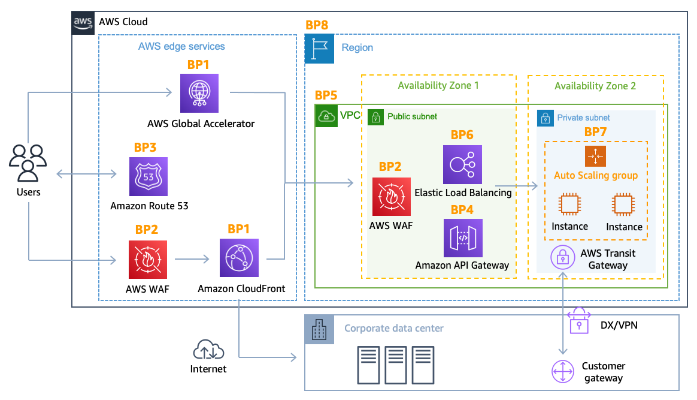
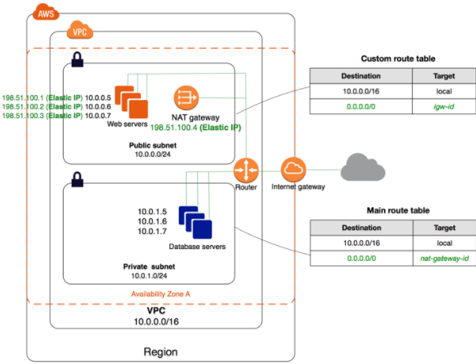

[Whizlabs-Site]: https://www.whizlabs.com "A world class technology training platform for your Teams"

# CFTIC 22-1272 / Administrador SysOps-DevOps AWS

## Extra - Security Engineering Test Questions from [Whizlabs][Whizlabs-Site]

### 1. Dominios de Conocimiento (SCS-C02) {#dominios}

| Dominio | Descripción | Peso |
| :---: | :---- | :---: |
| 1 | Threat Detection and Incident Response | 14% |
| 2 | Security Logging and Monitoring | 18% |
| 3 | Infrastructure Security | 20% |
| 4 | Identity and Access Management | 16% |
| 5 | Data Protection | 18% |
| 6 | Management and Security Governance | 14% |

### 2. Preguntas de Examen (Soluciones [aquí](#soluciones)) {#preguntas}

#### [Q01 SCS-C02DX-WL001](#a01-scs-c02dx-wl001)

A company hosts a popular web application that connects to an Amazon RDS MySQL DB instance running in a private VPC subnet that was created with default ACL settings. The IT Security department has a suspicion that a DDoS attack is coming from a suspecting IP. How can you protect the subnets from this attack?

- A. Change the Inbound Security Groups to deny access from the suspecting IP.
- B. Change the Outbound Security Groups to deny access from the suspecting IP.
- C. Change the Inbound NACL to deny access from the suspecting IP.
- D. Change the Outbound NACL to deny access from the suspecting IP.

#### [Q02 SCS-C02DX-WL002](#a02-scs-c02dx-wl002)

A company wants to have a secure way of generating, storing and managing cyptographic keys. But they want to have exclusive access for the keys. Which of the following can be used for this purpose?

- A. Use KMS and the normal KMS encryption keys.
- B. Use KMS and use an external key material.
- C. Use S3 Server Side encryption.
- D. Use Cloud HSM.

#### [Q03 SCS-C02DX-WL003](#a03-scs-c02dx-wl003)

A company is hosting a website that must be accesible to users for HTTPS traffic. Also port 22 should be open for administrative purposes. The administrator's workstation has a static IP address of 203.0.113.1/32. Which of the following security group configurations are the MOST secure but still functional to support these requirements? Choose 2 answers from the optlons given below.

- A. Port 443 coming from 0.0.0.0/0 
- B. Port 443 coming from 10.0.0.0/16 
- C. Port 22 coming from 0.0.0.0/0 
- D. Port 22 coming from 203.0.113.1/32 

#### [Q04 SCS-C02DX-WL004](#a04-scs-c02dx-wl004)

Your company has an EC2 instance that is hosted In an AWS VPC. There is a requirement to ensure that log files from the EC2 instance are stored  accordingly. The access should also be limited for the destination of the log files. How can this be accomplished? Choose 2 answers from the options given below. Each answer forms part of the solution.

- A. Stream the log files to a separate Cloudtrail trail.
- B. Stream the log files to a separate Cloudwatch Log group.
- C. Create an IAM policy that gives the desired level of access to the Cloudtrail trail.
- D. Create an IAM policy that gives the desired level of access to the Cloudwatch Log group.

#### [Q05 SCS-C02DX-WL005](#a05-scs-c02dx-wl005)

You have an EC2 instance in a private subnet which needs to access the KMS service privately within AWS network. Which of the following methods can help fulfil this requirement, keeping security in perspective?

- A. Use a VPC endpolnt.
- B. Attach an Internet gateway to the subnet.
- C. Attach a VPN connection to the VPC.
- D. Use VPC Peering.

#### [Q06 SCS-C02DX-WL006](#a06-scs-c02dx-wl006)

You have a website that is sitting behind AWS Cloudfront. You need to protect the website against threats such as SQL Injection and Cross site scripting attacks. Which of the following service can help in such a scenario?

- A. AWS Trusted Advisor.
- B. AWS WAF.
- C. AWS Inspector.
- D. AWS Config.

#### [Q07 SCS-C02DX-WL007](#a07-scs-c02dx-wl007)

Your company has a set of resources defined in the AWS Cloud. Their IT audit department has requested to get a list of resources that have been defined across the account. How can this be achieved in the easiest manner?

- A. Create a power shell script using the AWS CLI. Query for all resources with the tag of production.
- B. Create a bash shell script with the AWS CLI. Query for all resources in all regions. Store the results in an S3 bucket.
- C. Use Cloud Trail to get the list of all resources.
- D. Use AWS Config to get the list of all resources.

#### [Q08 SCS-C02DX-WL008](#a08-scs-c02dx-wl008)

A Lambda function reads metadata from an S3 object and stores the metadata in a DynamoDB table. The functio is triggered whenever an object is stored within the S3 bucket. How should the Lambda function be given access to the DynamoDB table?

- A. Create a VPC endpoint for DynamoDB within a VPC. Configure the Lambda function to access resources in the VPC.
- B. Create a resource policy that grants the Lambda function permissions to write to the DynamoDB table. Attach the policy to the DynamoDB table. 
- C. Create an IAM user with permissions to write to the DynamoDB table. Store an access key for that user in the Lambda environment variables. 
- D. Create an IAM service role with permissions to write to the DynamoDB table. Associate that role with the Lambda function.

#### [Q09 SCS-C02DX-WL009](#a09-scs-c02dx-wl009)

Your company has defined privileged users for their AWs Account. These users are administrators for key resources defined in the company. There is now a mandate to enhance the security authentication for these users. How can this be accomplished?

- A. Enable MFA for these user accounts.
- B. Enable versioning for these user accounts.
- C. Enable accidental deletion for these user accounts.
- D. Disable root access for the users.

#### [Q10 SCS-C02DX-WL010](#a10-scs-c02dx-wl010)

You have a 2 tier application hosted in AWS. It consists of a web server and database server (SQL Server) hosted on separate EC2 instances. You are devising the security groups for these EC2 instances. The Web tier needs to be accessed by users across the Internet. You have created a web security group (wg-123) and database security group (db-345). Which combination of the following security group rules will allow the application to be secure and functional? Choose 2 answers from the options given below.

- A. wg-123 - Allow ports 80 and 443 from 0.0.0.0/0.
- B. db-345 - Allow port 1433 from wg-123.
- C. wg-123 - Allow port 1433 from wg-123.
- D. db-345 - Allow ports 1433 from 0.0.0.0/0.

#### [Q11 SCS-C02DX-WL011](#a11-scs-c02dx-wl011)

Your company is performing a security audit to AWS environment and the security specialist asked you to provide a document that contained the status of all IAM users in the AWS account. In this document, it shoud include information such as when users were created, when passwords where used or changed last time, whether or not MFA was enabled, etc. What is the best way to provide this documentation?

- A. Use IAM CLI `list-users` to generate the JSON document for the status of all IAM users.
- B. Generate and download an IAM credential report through AWS Management Console or AWS SDKs.
- C. In AWS Config, select the resource type as `IAM:user` and download the resource inventory for all IAM users.
- D. Use AWS Athena to perform SQL query to AWS CloudTrail S3 bucket to get the IAM user information. Generate a report based on the Athena query result.

#### [Q12 SCS-C02DX-WL012](#a12-scs-c02dx-wl012)

Which of the following is used as a secure way to log into an EC2 Linux instance?

- A. IAM User name and password.
- B. Key pairs.
- C. AWS Access keys.
- D. AWS SDK keys.

#### [Q13 SCS-C02DX-WL013](#a13-scs-c02dx-wl013)

Your company owns a large number of AWS accounts managed by AWS Organizations. To meet security compliance, the CloudTrail should always be enabled in all AWS accounts. However, during the last couple of weeks, it was noticed that IAM users in certain AWS accounts disabled the CloudTrall feature. You need to add a restriction rule to prevent such actions. What is the best way to achieve that?

- A. For each IAM user, configure an inline IAM policy to deny the CloudTrail StopLogging action.
- Create an IAM policy to deny CloudTrail StopLogging action. Add the policy to each IAM user.
- C. Configure a Service Control Policy (SCP) to deny the CloudTrail StopLogging action and add the policy to the relevant OUs in the organization. 
- D. For each IAM user, add a permission boundary to disallow the CloudTrail StopLogging action.

#### [Q14 SCS-C02DX-WL014](#a14-scs-c02dx-wl014)

Every application in a company's portfolio has a separate AWS account for development and production. The security team wants to prevent the root user and all IAM users in the production accounts from accessing a specific set of unneeded services. How can they control this functionality?

- A. Create a Service Control Policy that denies access to the services. Assemble all production accounts in an organizational unit. Apply the policy to that organizational unit.
- B. Create a Service Control Policy that denies access to the services. Apply the policy to the root account.
- C. Create an IAM policy that denies access to the services. Associate the policy with an IAM group and enlist all users and the root users in this group.
- D. Create an IAM policy that denies access to the services. Create a Config Rule that checks that all users have the policy assigned. Trigger a Lambda function that adds the policy when found missing.

#### [Q15 SCS-C02DX-WL015](#a15-scs-c02dx-wl015)

A company is deploying a new web application on AWS. Based on their other web applications, they anticipate being the target of frequent DDoS attacks. Which steps can the company use to protect their application? Select 2 answers from the options given below.

- A. Associate the EC2 instances with a security group that blocks traffic from blacklisted IP addresses.
- B. Use an ELB Application Load Balancer and Auto Scaling group to scale to absorb application layer traffic.
- C. Use Amazon Inspector on the EC2 instances to examine incoming traffic and discard malicious traffic.
- D. Use CloudFront and AWS WAE to prevent malicious traffic from reaching the application.
- E. Enable GuardDuty to block malicious traffic from reaching the application.

#### [Q16 SCS-C02DX-WL016](#a16-scs-c02dx-wl016)

You have a set of Keys defined using the AWS KMS service. You want to stop using a couple of keys, but are not sure of which services are currently using the keys. Which of the following would be a safe option to stop using the keys from further usage?

- A. Delete the keys since anyway there is a 7 day waiting period before deletion.
- B. Disable the keys.
- C. Set an alias for the key.
- D. Change the key material for the key.

#### [Q17 SCS-C02DX-WL017](#a17-scs-c02dx-wl017)

You are building a large-scale confidential documentation web server on AWS and all of the documentation for it will be stored on S3. One of the requirements is that it cannot be publicly accessible from s3 directly, and you will need to use CloudEront to accomplish this. Which of the methods listed below would satisty the requirements as outlined? Choose an answer from the options below.

- A. Create an Identity and Access Management (IAM) user for CloudEront and grant access to the objects in your S3 bucket to that IAM User.
- B. Create an Origin Access Identity (OAI) for CloudFront and grant access to the objects in your S3 bucket to that OAI.
- C. Create individual policies for each bucket the documents are stored in and, in that policy, grant access to only CloudFront.
- D. Create an S3 bucket policy that lists the CloudFront distribution ID as the Principal and the target bucket as the Amazon Resource Name (ARN). 

#### [Q18 SCS-C02DX-WL018](#a18-scs-c02dx-wl018)

Your company makes use of S3 buckets for storing data. There is a company 
policy that all services should have logging enabled. How can you ensure that logging is always enabled for created S3 buckets In the AWS Account?

- A. Use AWS Inspector to inspect all S3 buckets and enable logging for those where it is not enabled.
- B. Use AWS Config Rules to check whether logging is enabled for buckets.
- C. Use AWS Cloudwatch metrics to check whether logging is enabled for buckets.
- D. Use AWS Cloudwatch logs to check whether logging is enabled for buckets.

#### [Q19 SCS-C02DX-WL019](#a19-scs-c02dx-wl019)

You have a paid service providing custom digital art that is hosted on AWS using S3. In order to promote your service, you wish to provide a limited sample of artwork to unauthenticated guest users for free. Which combination of steps will enable guest users to view your free subset of artwork? (Select TWO).

- A. Enable Unauthenticated identities in Amazon Cognito User Pools.
- B. Enable Unauthenticated identities in Amazon Cognito Identity Pools.
- C. Turn on public access in AWS S3 Bucket Permissions.
- D. Assign an IAM Role with appropriate S3 Access permissions.

#### [Q20 SCS-C02DX-WL020](#a20-scs-c02dx-wl020)

Your current setup in AWS consists of the following architecture: 2 public subnets, one subnet which has the web servers accessed by users across the internet and the other subnet for the database server. Which of the following changes to the architecture would add a better security boundary to the resources hosted in your setup?

- A. Consider moving the web server to a private subnet.
- B. Consider moving the database server to a private subnet.
- C. Consider moving both the web and database serverto a private subnet.
- D. Consider creating a private subnet and adding a NAT instance to that subnet.

#### [Q21 SCS-C02DX-WL021](#a21-scs-c02dx-wl021)

Your company has a set of resources defined in AWS. These resources consist of applications hosted on EC2 Instances. Data is stored on EBS volumes and S3. The company mandates that all data should be encrypted at rest. How can you achieve this? Choose 2 answers from the options below.

- A. Enable SSL with the underlying EBS volumes.
- B. Enable EBS Encryption.
- C. Make sure that data is transmitted from S3 via HTTPS.
- D. Enable S3 server-side Encryption.

#### [Q22 SCS-C02DX-WL022](#a22-scs-c02dx-wl022)

Your company is planning on the following architecture for their application:

- A set of EC2 instances hosting the web part of the application.
- A relatilonal database for the backend using the AWS RDS MySQL service.
- A Load balancer for distribution of traffic.

There is a requirement to ensure that all data hosted in the database service is encrypted at rest. How can you achieve this requirement in the easiest manner? (Select 2).

- A. Encrypt the underlying EBS volumes for the database.
- B. Use the Encryption feature for RDS.
- C. Use S3 server-side encryption.
- D. Use AWS Key Management Service.

#### [Q23 SCS-C02DX-WL023](#a23-scs-c02dx-wl023)

Your company needs to develop an application that needs to have a login module in place. Their key requirement is to ensure that users can also use their current identíties with various providers such as Facebook to log into the application. Which of the following can help you accomplish this?

- A. Using the AWS Cognito service.
- B. Using the AWS Config service.
- C. Using the AWS SQS service.
- D. Using the AWS WAF service.

#### [Q24 SCS-C02DX-WL024](#a24-scs-c02dx-wl024)

You have currently contacted an AWS Partner Network (APN) partner to carry out an audit for your AWS account. You need to ensure that the partner can carry out an audit on your resources. Which one of the following steps would you ideally carry out?

- A. Create an IAM user for the partner account for login purposes.
- B. Create a cross account IAM Role and share the ARN with APN.
- C. Create an IAM group for the partner account for login purposes.
- D. Create an IAM profile for the partner account for login purposes.

#### [Q25 SCS-C02DX-WL025](#a25-scs-c02dx-wl025)

Your company uses an AWS Transit Gateway as a hub to manage the interconnections between multiple VPCs and the on-premises networks. The security team asks you to implement a control that can allow or block the traffic between the EC2 network interface workload and the Transit Gateway. Which of the following approaches would you select?

- A. Attach the EC2 instances with an IAM role that has the AWS managed policy `AWSNetworkManagerServiceRolePolicy`.
- B. Associate security groups to the EC2 instance network interface and the Transit Gateway to control the traffic.
- C. Create route tables in the AWS Transit Gateway to allow or disallow the traffic from the EC2 workload.
- D. Apply NACL rules between EC2 instances in the subnets and Transit Gateway associations to control the traffic.

#### [Q26 SCS-C02DX-WL026](#a26-scs-c02dx-wl026)

A new application is deployed in an Amazon EC2 instance which is launched in a private subnet of Amazon VPC. This application will be fetching data from Amazon S3 as well as from Amazon DynamoDB. The communication between the Amazon EC2 instance and Amazon S3 as well as with Amazon DynamoDB should be secure and should not transverse over internet links. The connectivity should also support accessing data in Amazon S3 from an on-premises network in the future. What design can be implemented to have secure connectivity?

- A. Access Amazon DynamoDB from an instance in a private subnet using a gateway endpoint. Access Amazon S3 from an instance in a private subnet using an interface endpoint.
- B. Access Amazon S3 and Amazon DynamoDB from an instance in a private subnet using a private NAT gateway.
- C. Access Amazon S3 and Amazon DynamoDB from an instance in a private subnet using a public NAT gateway.
- D. Access Amazon S3 and Amazon DynamoDB from an instance in a private subnet using a gateway endpoint.

#### [Q27 SCS-C02DX-WL027](#a27-scs-c02dx-wl027)

You plan to manage API keys in AWS Secrets Manager. The keys need to be automatically rotated to be compliant with the company policy. From Secrets Manager, applications can get the latest version of the API credentials. How would you implement the rotation of keys?

- A. Use AWS Parameter Store to store and rotate the Keys as Secrets Manager does not support it.
- B. Directly add multiple keys in Secrets Manager for rotation and the keys will be rotated every year automatically.
- C. Customize the Lambda function that performs the rotation of secrets in Secrets Manager. 
- D. Create two secrets in Secrets Manager to store two versions of the API credentials. Modify the application to get one of them.

#### [Q28 SCS-C02DX-WL028](#a28-scs-c02dx-wl028)

The customer data of an application is stored in an S3 bucket. Your team would like to use Amazon Athena to analyze the data using standard SQL. However, the data in the S3 bucket is encrypted via SSE-KMS. How would you create the table in Athena for the encrypted data in S3?

- A. You need to provide the private KMS key to Athena.
- B. Athena decrypts the data automatically, and you do not need to provide key information.
- C. You need to convert SSE-KMS to SSE-S3 before creating the table in Athena.
- D. You need to disable the server-side encryption in S3 before creating the Athena table.

#### [Q29 SCS-C02DX-WL029](#a29-scs-c02dx-wl029)

You work in a start-up company as an AWS solutions architect. You create a new AWS Organization that includes a large amount of AWS accounts. You want to use a tool to trigger a notification whenever the administrator performs an action in the Organization. Which of the following AWS services would you use?

- A. AWS CloudWatch Events.
- B. AWS Config Resources.
- C. AWS CloudTrail.
- D. AWS CloudWatch Logs.

#### [Q30 SCS-C02DX-WL030](#a30-scs-c02dx-wl030)

A startup company wants to launch an online learning portal on AWS using CloudFront and S3. They have different subscription models: one model where all the members will have access to basic content but another model where the company provides premium content that includes access to multiple private contents without changing their current links.

How should a Solution Architect design this solution to meet the requirements?

- A. Design the learning portal using CloudFront web distribution to deliver the premium private content using Signed Cookies.
- B. Design the learning portal using CloudFront web distribution to deliver the premium private content using Signed URLs.
- C. Design the learning portal using CloudFront web disinbutlon to deliver the premium private content using S3 pre-signed URLs.
- D. Design the learning portal using CloudFront web disinbution to deliver the premium private content using CloudFront geographic restrictions feature.

***

### Soluciones

#### [A01 SCS-C02DX-WL001](#q01-scs-c02dx-wl001)

- Respuesta:
    - C. Change the Inbound NACL to deny access from the suspecting IP.

Justificación

> Option A and B are invalid because the Security Groups already block traffic by default. You can use NACL’s as an additional security layer for the subnet to deny traffic. Option D is invalid since just changing the Inbound Rules is sufficient. AWS Documentation mentions the following: A Network access control list (ACL) is an optional layer of security for your VPC that acts as a firewall for controlling traffic in and out of one or more subnets. You might set up network ACLs with rules similar to your security groups in order to add an additional layer of security to your VPC.
>
> For more information on Network Access Control Lists, please visit: https://docs.aws.amazon.com/AmazonVPC/latest/UserGuide/VPC_ACLs.html

#### [A02 SCS-C02DX-WL002](#q02-scs-c02dx-wl002)

- Respuesta:
    - D. Use Cloud HSM.

Justificación

> The AWS Documentation mentions the following:
>
> The AWS Cloud HSM service helps you meet corporate, contractual and regulatory compliance requirements for data security by using dedicated Hardware Security Module (HSM) instances within the AWS cloud. AWS and AWS Marketplace partners offer a variety of solutions for protecting sensitive data within the AWS platform, but for some applications and data subject to contractual or regulatory mandates for managing cryptographic keys, additional protection may be necessary. CloudHSM complements existing data protection solutions and allows you to protect your encryption keys within HSMs that are desigr and validated to government standards for secure key management. CloudHSM allows you to securely generate, store and manage cryptographic keys used for data encryption in a way that keys are accessible only by you.
>
> Options A, B and C are invalid because in all of these cases, the management of the key will be with AWS. Here the question specifically mentions that you want to have exclusive access over the keys. This can be achieved with Cloud HSM.
>
> For more information on CloudHSM, please visit: https://aws.amazon.com/cloudhsm/faq

#### [A03 SCS-C02DX-WL003](#q03-scs-c02dx-wl003)

- Respuestas:
    - A. Use KMS and the normal KMS encryption keys.
    - D. Use Cloud HSM.

Justificación

>

#### [A04 SCS-C02DX-WL004](#q04-scs-c02dx-wl004)

- Respuestas:
    - B. Stream the log files to a separate Cloudwatch Log group.
    - D. Create an IAM policy that gives the desired level of access to the Cloudwatch Log group.

Justificación

> You can create a Log group and send all logs from the EC2 Instance to that group. You can then limit the access to the Log groups via an IAM policy.
>
> Option A is invalid because Cloudtrail is used to record API activity and not for storing log files. Option C is invalid because Cloudtrail is the wrong service to be used for this requirement.

#### [A05 SCS-C02DX-WL005](#q05-scs-c02dx-wl005)

- Respuesta:
    - A. Use a VPC endpolnt.

Justificación

> Documentation mentions the following:
>
> You can connect directly to AWS KMS through a private endpoint in your VPC instead of connecting over the internet. When you use a VPC endpoint, communication between your VPC and AWS KMS is conducted entirely within the AWS network.
>
> Option B is invalid because this could open threats from the internet. Option C is invalid because this is normally used for communication between on-premise environments and AWS. Option D is invalid because this is normally used for communication between VPC's.
>
> For more information on accessing KMS via an endpoint, please visit: https://docs.aws.amazon.com/kms/latest/developerguide/kms-vpc-endpoint.html

#### [A06 SCS-C02DX-WL006](#q06-scs-c02dx-wl006)

- Respuesta:
    - B. AWS WAF.

Justificación

> The AWS Documentation mentions the following:
>
> AWS WAF is a web application firewall that helps detect and block malicious web requests targeted at your web applications. AWS WAF allows you to create rules that can help protect against common web exploits like SQL injection and cross-site scripting. With AWS WAF you first identify the resource (either an Amazon CloudFront distribution or an Application Load Balancer) that you need to protect.
>
> Option A is invalid because this will only give advise on how you can better the security in your AWS account but not protect against threats mentioned in the question. Option C is invalid because this can be used to scan EC2 Instances for vulnerabilities but not protect against threats mentioned in the question. Option D is invalid because this can be used to check config changes but not protect against threats mentioned in the quest.

#### [A07 SCS-C02DX-WL007](#q07-scs-c02dx-wl007)

- Respuesta:
    - D. Use AWS Config to get the list of all resources.

Justificación

> The most feasible option is to use AWS Config. When you turn on AWS Config, you will get a list of resources defined in your AWS Account.
>
> Option A is incorrect because this would give the list of production based resources and now all resources. Option B is partially correct but this will just add more maintenance overhead. Option C is incorrect because this can be used to log API activities but not give an account of all resources.

#### [A08 SCS-C02DX-WL008](#q08-scs-c02dx-wl008)

- Respuesta:
    - D. Create an IAM service role with permissions to write to the DynamoDB table. Associate that role with the Lambda function.

Justificación

> The ideal way is to create an IAM role which has the required permissions and then associate it with the Lambda function. The AWS Documentation additionally mentions the following:
>
> Each Lambda function has an IAM role (execution role) associated with it. You specify the IAM role when you create your Lambda function. Permissions you grant to this role determine what AWS Lambda can do when it assumes the role. There are two types of permissions that you grant to the IAM role:
> - If your Lambda function code accesses other AWS resources, such as to read an object from an S3 bucket or write logs to CloudWatch Logs, you need to grant permissions for relevant Amazon S3 and CloudWatch actions to the role.
> - If the event source is stream-based (Amazon Kinesis Data Streams and DynamoDB streams), AWS Lambda polls these streams on your behalf. AWS Lambda needs permissions to poll the stream and read new records on the stream so you need to grant the relevant permissions to this role.
>
> Option A is invalid because the VPC endpoint allows access instances in a private subnet to access DynamoDB. Option B is invalid because resources policies are present for resources such as S3 and KMS , but not AWS Lambda. Option C is invalid because AWS Roles should be used and not IAM Users.
>
> For more information on the Lambda permission model, please visit  https://docs.aws.amazon.com/lambda/latest/dg/intro-permission-model.html

#### [A09 SCS-C02DX-WL009](#q09-scs-c02dx-wl009)

- Respuesta:
    - A. Enable MFA for these user accounts.

Justificación

> The AWS Documentation mentions the following:
>
> As a best practise for IAM users for extra security, enable multi-factor authentication (MFA) for privileged IAM users (users who are allowed access to sensitive resources or APIs). With MFA, users have a device that generates a unique authentication code (a one-time password, or OTP). Users must provide both their normal credentials (like their user name and password) and the OTP. The MFA device can either be a special piece of hardware, or it can be a virtual device (for example, it can run in an app on a smartphone).
>
> Option B,C and D are invalid because no such security options are available in AWS.
>
> For more information on IAM best practises, please visit://docs.aws.amazon.com/IAM/latest/UserGuide/best-practices.html

#### [A10 SCS-C02DX-WL010](#q10-scs-c02dx-wl010)

- Respuestas:
    - A. wg-123 - Allow ports 80 and 443 from 0.0.0.0/0.
    - B. db-345 - Allow port 1433 from wg-123.

Justificación

> The Web security groups should allow access for ports 80 and 443 for HTTP and HTTPS traffic to all users from the internet. The database security group should just allow access from the web security group from port 1433.
>
> Option C is invalid because this is not a valid configuration. Option D is invalid because database security should not be allowed on the internet.
>
> For more information on Security Groups please visit: https://docs.aws.amazon.com/AWSEC2/latest/UserGuide/using-network-security.html

#### [A11 SCS-C02DX-WL011](#q11-scs-c02dx-wl011)

- Respuesta:
    - B. Generate and download an IAM credential report through AWS Management Console or AWS SDKs.

Justificación

> 

#### [A12 SCS-C02DX-WL012](#q12-scs-c02dx-wl012)

- Respuesta:
    - B. Key pairs.

Justificación

> The AWS Documentation mentions the following:
>
> Key pairs consist of a public key and a private key. You use the private key to create a digital signature, and then, AWS uses the corresponding public key to validate the signature. Key pairs are used only for Amazon EC2 and Amazon CloudFront.
>
> Option A,C and D are all wrong because these are not used to log into EC2 Linux instances.
>
> For more information on AWS Security credentials, please visit: https://docs.aws.amazon.com/general/latest/gr/aws-sec-cred-types.html

#### [A13 SCS-C02DX-WL013](#q13-scs-c02dx-wl013)

- Respuesta:
    - C. Configure a Service Control Policy (SCP) to deny the CloudTrail StopLogging action and add the policy to the relevant OUs in the organization. 

Justificación

>

#### [A14 SCS-C02DX-WL014](#q14-scs-c02dx-wl014)

- Respuesta:
    - A. Create a Service Control Policy that denies access to the services. Assemble all production accounts in an organizational unit. Apply the policy to that organizational unit.

Justificación

> To prevent the root and IAM users of the production team not to access the unneeded set of services one needs to incorporate SCP (Service Control Policy) which helps the organization manage different permission roles in the AWS account.
>
> - It facilitates central control over the present permissions for all accounts of AWS in an organization.
> - Through this policy, the administrator can limit the root and IAM users of the production to access unnecessary services.
> - This affects only the IAM users and root roles which are managed by accounts that are part of the organizational unit.
> - Hence, the functionality provided in option A is valid for managing the permissions of AWS services in an organization.

#### [A15 SCS-C02DX-WL015](#q15-scs-c02dx-wl015)

- Respuesta:
    - B. Use an ELB Application Load Balancer and Auto Scaling group to scale to absorb application layer traffic.
    - D. Use CloudFront and AWS WAE to prevent malicious traffic from reaching the application.

Justificación

> The below diagram from AWS shows the best case scenario for avoiding DDos attacks using services such as AWS Cloudfront, WAF, ELB and Autoscaling.
>
>
>
> Option A is invalid because by default security groups don't allow access. Option C is invalid because AWS Inspector cannot be used to examine traffic. Option E is invalid because this can be used for attacks on EC2 instances but not against DDos attacks on the entire application.
>
> For more information on DDos mitigation from AWS, please visit: https://aws.amazon.com/answers/networking/aws-ddos-attack-mitigation/

#### [A16 SCS-C02DX-WL016](#q16-scs-c02dx-wl016)

- Respuesta:
    - B. Disable the keys.

Justificación

> The AWS Documentation mentions the following:
>
> Deleting a customer master key (CMK) in AWS Key Management Service (AWS KMS) is destructive and potentially dangerous. It deletes the key material and all metadata associated with the CMK, and is irreversible. After a CMK is deleted you can no longer decrypt the data that was encrypted under that CMK, which means that data becomes unrecoverable. You should delete a CMK only when you are sure that you don't need to use it anymore. If you are not sure, consider disabling the CMK instead of deleting it. You can re-enable a disabled CMK if you need to use it again later, but you cannot recover a deleted CMK.
>
> Option A is invalid because once you schedule the deletion, you cannot come back from the deletion process. Option C and D are invalid because these will not check to see if the keys are being used or not.
>
> For more information on deleting keys from KMS, please visit: https://docs.aws.amazon.com/kms/latest/developerguide/deleting-keys.html

#### [A17 SCS-C02DX-WL017](#q17-scs-c02dx-wl017)

- Respuesta:
    - B. Create an Origin Access Identity (OAI) for CloudFront and grant access to the objects in your S3 bucket to that OAI.

Justificación

> If you want to use CloudFront signed URLs or signed cookies to provide access to objects in your Amazon S3 bucket, you probably also want to prevent users from accessing your Amazon S3 objects using Amazon S3 URLs. If users access your objects directly in Amazon S3, they bypass the controls provided by CloudFront signed URLs or signed cookies, for example, control over the date and time that a user can no longer access your content and control over which IP addresses can be used to access content. In addition, if users access objects both through CloudFront and directly by using Amazon S3 URLs, CloudFront access logs are less useful because they're incomplete.
>
> Option A is invalid because you need to create an Origin Access Identity for Cloudfront and not an IAM user. Option C and D are invalid because using policies will not help fulfil the requirement.
>
> For more information on Origin Access Identity please see http://docs.aws.amazon.com/AmazonCloudFront/latest/DeveloperGuide/private-content-restricting-access-to-s3.html

#### [A18 SCS-C02DX-WL018](#q18-scs-c02dx-wl018)

- Respuesta:
    - B. Use AWS Config Rules to check whether logging is enabled for buckets.

Justificación

> This is given in the AWS Documentation as an example rule in AWS Config.
>
> Option A is invalid because AWS Inspector cannot be used to scan all buckets. Option C and D are invalid because Cloudwatch cannot be used to check for logging enablement for buckets.
>
> For more information on Config Rules please see https://docs.aws.amazon.com/config/latest/developerguide/evaluate-config-rules.html

#### [A19 SCS-C02DX-WL019](#q19-scs-c02dx-wl019)

- Respuesta:
    - B. Enable Unauthenticated identities in Amazon Cognito Identity Pools.
    - D. Assign an IAM Role with appropriate S3 Access permissions.

Justificación

>

#### [A20 SCS-C02DX-WL020](#q20-scs-c02dx-wl020)

- Respuesta:
    - B. Consider moving the database server to a private subnet.

Justificación

> The ideal setup is to host the web server in the public subnet so that it can be accessed by users on the Internet. The database server can be hosted in the private subnet. The below diagram from AWS Documentation shows the set up:
>
> 
>
> Creating a private subnet and moving the database server to it will provide a higher level of security for the database. This will help to reduce the risk of unauthorized access to the database server, as it will only be accessible from within the private subnet.
>
> For more information on public and private subnets in AWS, kindly refer to https://docs.aws.amazon.com/AmazonVPC/latest/UserGuide/VPC_Scenario2.html 

#### [A21 SCS-C02DX-WL021](#q21-scs-c02dx-wl021)

- Respuesta:
    - B. Enable EBS Encryption.
    - D. Enable S3 server-side Encryption.

Justificación

>

#### [A22 SCS-C02DX-WL022](#q22-scs-c02dx-wl022)

- Respuesta:
    - B. Use the Encryption feature for RDS.
    - D. Use AWS Key Management Service.

Justificación

>

#### [A23 SCS-C02DX-WL023](#q23-scs-c02dx-wl023)

- Respuesta:
    - A. Using the AWS Cognito service.

Justificación

>

#### [A24 SCS-C02DX-WL024](#q24-scs-c02dx-wl024)

- Respuesta:
    - B. Create a cross account IAM Role and share the ARN with APN.

Justificación

>

#### [A25 SCS-C02DX-WL025](#q25-scs-c02dx-wl025)

- Respuesta:
    - D. Apply NACL rules between EC2 instances in the subnets and Transit Gateway associations to control the traffic.

Justificación

>

#### [A26 SCS-C02DX-WL026](#q26-scs-c02dx-wl026)

- Respuesta:
    - A. Access Amazon DynamoDB from an instance in a private subnet using a gateway endpoint. Access Amazon S3 from an instance in a private subnet using an interface endpoint.

Justificación

>

#### [A27 SCS-C02DX-WL027](#q27-scs-c02dx-wl027)

- Respuesta:
    - C. Customize the Lambda function that performs the rotation of secrets in Secrets Manager. 

Justificación

>

#### [A28 SCS-C02DX-WL028](#q28-scs-c02dx-wl028)

- Respuesta:
    - B. Athena decrypts the data automatically, and you do not need to provide key information.

Justificación

>

#### [A29 SCS-C02DX-WL029](#q29-scs-c02dx-wl029)

- Respuesta:
    - A. AWS CloudWatch Events.

Justificación

>

#### [A30 SCS-C02DX-WL030](#q30-scs-c02dx-wl030)

- Respuesta:
    - A. Design the learning portal using CloudFront web distribution to deliver the premium private content using Signed Cookies.

Justificación

> Use signed cookies in the following cases to provide access to multiple restricted files:
>
> - For example, all the files for a video in HLS format or all of the files in the subscribers' area of the website.
> - You don't want to change your current URLs.
>
> Option B is incorrect.CloudFront signed URLs and signed cookies provide the same basic functionality, and they allow users to control who can access the content. Use signed URLs in the following cases:
>
> - You want to restrict access to individual files, for example, an installation download for your application-
> - Your users are using a client (for example, a custom HTTP client) that doesn't support cookies.
>
> Option C is incorrect because S3 pre-signed URLs won't provide access without changing current links.
>
> Option D is incorrect because it does not meet the requirement of providing premium private content to subscribers who have paid for it.
>
> References:
> - https://docs.aws.amazon.com/AmazonCloudFront/latest/DeveloperGuide/private-content-choosing-signed-urls-cookies.html
> - https://docs.aws.amazon.com/AmazonCloudFront/latest/DeveloperGuide/private-content-choosing-signed-urls-cookies.html
> - https://docs.aws.amazon.com/AmazonS3/latest/dev/ShareObjectPreSignedURL.html
> - https://docs.aws.amazon.com/AmazonCloudFront/latest/DeveloperGuide/private-content-signed-urls.html 
